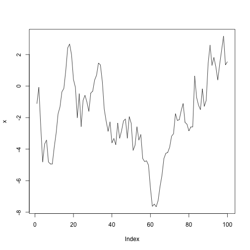

Split up [[1.1 Notation]], factoring in,
	

```r
set.seed(1213)  # for reproducibility
x = cumsum(rnorm(100))
mean(x);
```

```
## [1] -1.939758
```

```r
plot(x, type = 'l')  # Brownian motion
```



[[2.9 Notation of Triple Integrals]]
[[2.3 Notation of Double Integrals]]

- Merge some of the [[2-1 Double and triple integrals]] subheadings into their own notes, eg [[XXX. Double Integrals]] & [[XXX. Triple Integrals]].

- Need to make a note on the [[Jacobian]].

- How are we going to deal with semantic collisions such as [[2.13 Gradient]] and Anal 2B's Gradient?

- Contours and Level sets, see [[2.18 Gradient is Perpendicular to Contours]]

- What am I doing with heading sizes in the notes.


- Do we want to move 2, definition of scalar and vector field into 1 then split 2-1 and 2-2 into their own sections?
	- Further this create a vector objects section and discuss Vector, Scalar fields, Lines, Surfaces, etc
	- [[5 Surfaces and surface integrals#5 1 Surfaces]]

- Tool for auto JD numbering and rearranging notes


- Move [[2-2 Directional Derivatives, Gradients, and Potentials#2 2 2 A note on conservative fields and potentials]] into [[4 Conservative forces]].


- Make notes more "atomic"
	- Research knowledge management stuff

## Åtomising

For now atomise within the containers

- Vector Objects
	- Vector Field
	- Scalar Field
	- Curves
		- ...
	- Planes
		- ...
- Integration in Vector Spaces
	- Double Integrals
	- Triple Integrals
	- Surface Integrals
- Differentiation in Vector Spaces
	- Grad
	- Divergence
		- Variable Free
	- Curl
		- Variable Free
	- Divergence Theorem
	- Stokes Theorem


- split up [[6.10 Properties of Certain Second Derivatives]]


- Move [[7 The Divergence Theorem#7 1 Geometrical definitions]] to its own bit and merge with Anal 2A.

- Re-examine what is in [[5.12 Scalar Surface Integrals via a Parametric Representation]], should this be renamed?


## Splits
- 6
	- Divergence
	- Curl
	- Vector Calc Identities
- 7
	- Geometric shit into that bucket
	- Divergence Theorem
	- Green's Theorem
- 
[](2.5%20Chain%20Rule%20for%20Real%20Functions.md#%5Ez1mmi2l)

----

```dataview
table "\\\"" as name
```

## Complex Diff

Move notes on the chain rule and stuff into a common note for $\R$ and $\C$.

---

[[083. Lec 34, Paramagnetism#Quantitative Look ([mn](marginnote3app://note/91F7892A-963D-41D9-B86B-00AB9572B9DF))]]
